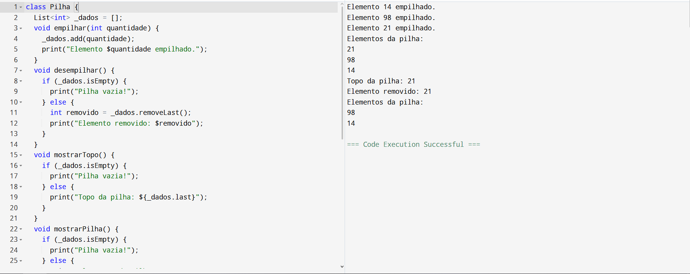
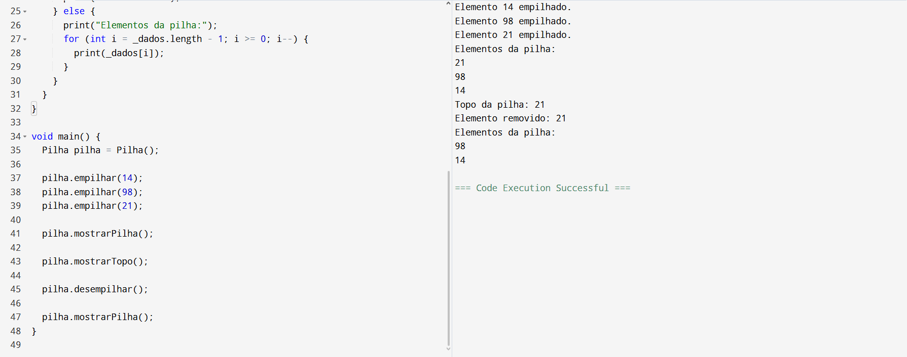

class Pilha {
  List<int> _dados = [];
  void empilhar(int quantidade) {
    _dados.add(quantidade);
    print("Elemento $quantidade empilhado.");
  }
  void desempilhar() {
    if (_dados.isEmpty) {
      print("Pilha vazia!");
    } else {
      int removido = _dados.removeLast();
      print("Elemento removido: $removido");
    }
  }
  void mostrarTopo() {
    if (_dados.isEmpty) {
      print("Pilha vazia!");
    } else {
      print("Topo da pilha: ${_dados.last}");
    }
  }
  void mostrarPilha() {
    if (_dados.isEmpty) {
      print("Pilha vazia!");
    } else {
      print("Elementos da pilha:");
      for (int i = _dados.length - 1; i >= 0; i--) {
        print(_dados[i]);
      }
    }
  }
}

void main() {
  Pilha pilha = Pilha();

  pilha.empilhar(14);
  pilha.empilhar(98);
  pilha.empilhar(21);

  pilha.mostrarPilha();

  pilha.mostrarTopo();

  pilha.desempilhar();

  pilha.mostrarPilha();
}

